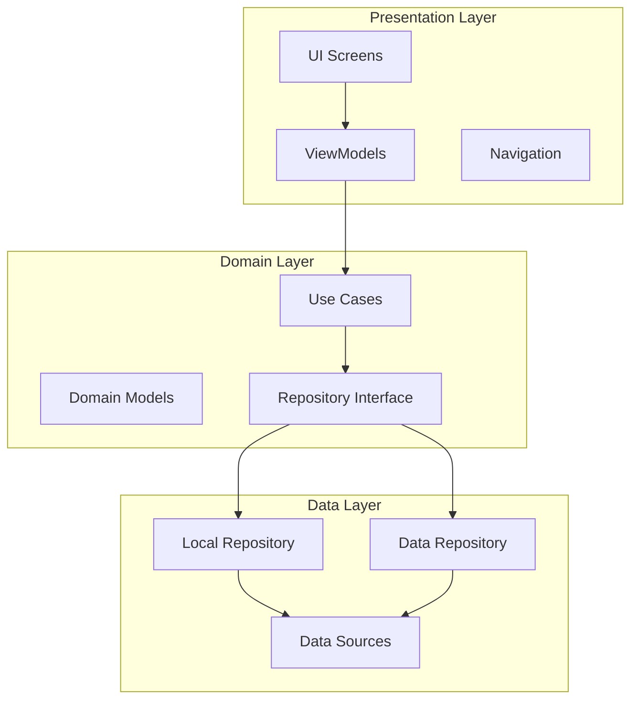
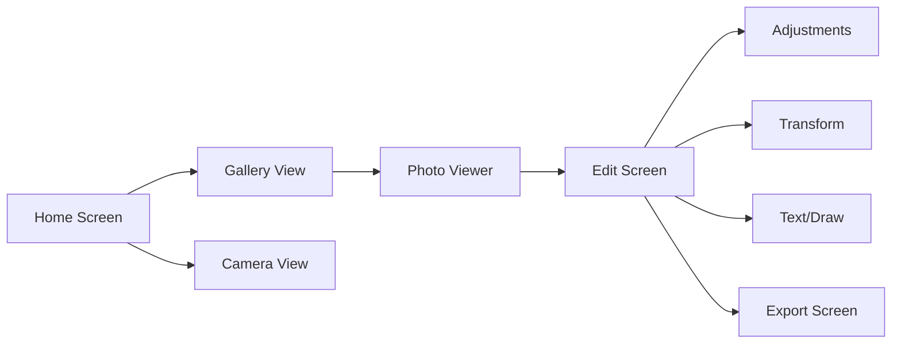
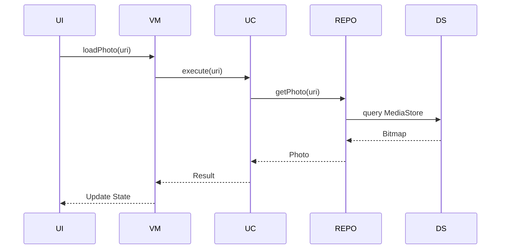
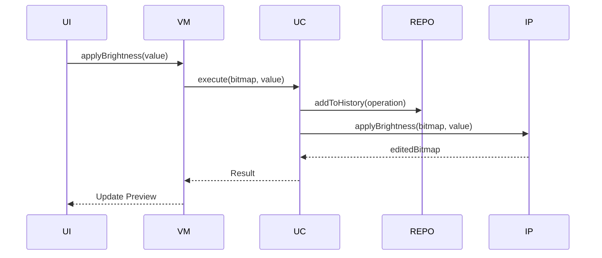

# PhotoNext - Mimari Dokümantasyonu

## 📐 Genel Mimari

PhotoNext, **Clean Architecture** prensiplerine dayanan modern bir Android uygulamasıdır. Mimari, test edilebilirliği, bakım kolaylığını ve ölçeklenebilirliği hedefler.



---

## 🗂️ Katmanlar

### 1. Presentation Layer (Sunum Katmanı)

**Sorumluluklar:**
- UI bileşenlerini yönetme
- Kullanıcı etkileşimlerini işleme
- ViewModel'ler üzerinden veri akışını sağlama
- State yönetimi

**Bileşenler:**
- **Screens:** Ana ekranlar (Home, Edit, Export)
- **ViewModels:** UI state'ini yöneten sınıflar
- **Components:** Yeniden kullanılabilir UI bileşenleri
- **Navigation:** Ekranlar arası navigasyon

**Teknolojiler:**
- Jetpack Compose
- StateFlow
- Compose State
- Navigation Compose

---

### 2. Domain Layer (Domain Katmanı)

**Sorumluluklar:**
- İş mantığını içerir
- Use case'leri tanımlar
- Domain modellerini içerir
- Repository interface'lerini tanımlar

**Bileşenler:**
- **Use Cases:** Tek bir işlevi gerçekleştiren sınıflar
- **Domain Models:** İş mantığı için gerekli veri modelleri
- **Repository Interfaces:** Data layer ile iletişim için arayüzler

**Use Case Örnekleri:**
```kotlin
class LoadPhotoUseCase(private val repository: PhotoRepository)
class AdjustBrightnessUseCase(private val repository: PhotoRepository)
class SavePhotoUseCase(private val repository: PhotoRepository)
class UndoEditUseCase(private val repository: PhotoRepository)
```

---

### 3. Data Layer (Veri Katmanı)

**Sorumluluklar:**
- Veri kaynaklarından veri alımı
- Veri işleme ve dönüşümü
- Repository implementasyonları
- Cache yönetimi

**Bileşenler:**
- **Repositories:** Use case'ler için veri sağlar
- **Data Sources:** 
  - Local: Room Database, SharedPreferences
  - Remote: (ileride eklenebilir)
- **Mappers:** Data model dönüşümleri

---

## 🎨 UI/UX Mimari

### Ekran Yapısı



### State Yönetimi

**UI State Pattern:**
```kotlin
sealed class EditUiState {
    object Loading : EditUiState()
    data class Success(val photo: EditedPhoto) : EditUiState()
    data class Error(val message: String) : EditUiState()
}
```

**Edit State Pattern:**
```kotlin
data class EditState(
    val brightness: Float = 0f,
    val contrast: Float = 0f,
    val saturation: Float = 0f,
    val rotation: Int = 0,
    val cropRect: Rect? = null,
    val history: List<EditOperation> = emptyList(),
    val historyIndex: Int = -1
)
```

---

## 🔧 Teknik Detaylar

### 1. Fotoğraf İşleme

**Bitmap Manipülasyonu:**
```kotlin
class ImageProcessor {
    fun applyBrightness(bitmap: Bitmap, value: Float): Bitmap
    fun applyContrast(bitmap: Bitmap, value: Float): Bitmap
    fun applySaturation(bitmap: Bitmap, value: Float): Bitmap
    fun rotateBitmap(bitmap: Bitmap, degrees: Int): Bitmap
    fun cropBitmap(bitmap: Bitmap, rect: Rect): Bitmap
}
```

**ColorMatrix Kullanımı:**
```kotlin
class ColorMatrixFactory {
    fun createBrightnessMatrix(value: Float): ColorMatrix
    fun createContrastMatrix(value: Float): ColorMatrix
    fun createSaturationMatrix(value: Float): ColorMatrix
    fun createSepiaMatrix(): ColorMatrix
    fun createGrayscaleMatrix(): ColorMatrix
}
```

### 2. Undo/Redo Sistemi

**Edit Operation Pattern:**
```kotlin
sealed class EditOperation {
    data class Brightness(val value: Float) : EditOperation()
    data class Contrast(val value: Float) : EditOperation()
    data class Saturation(val value: Float) : EditOperation()
    data class Rotate(val degrees: Int) : EditOperation()
    data class Crop(val rect: Rect) : EditOperation()
}
```

**History Manager:**
```kotlin
class EditHistoryManager {
    private val history = mutableListOf<EditOperation>()
    private var currentIndex = -1
    
    fun addOperation(operation: EditOperation)
    fun undo(): EditOperation?
    fun redo(): EditOperation?
    fun canUndo(): Boolean
    fun canRedo(): Boolean
    fun clear()
}
```

### 3. Real-time Preview

**Debounce Pattern:**
```kotlin
class PreviewManager(
    private val scope: CoroutineScope,
    private val delayMillis: Long = 100
) {
    private var job: Job? = null
    
    fun updatePreview(
        bitmap: Bitmap,
        edits: List<EditOperation>,
        onPreviewReady: (Bitmap) -> Unit
    ) {
        job?.cancel()
        job = scope.launch {
            delay(delayMillis)
            val result = applyEdits(bitmap, edits)
            onPreviewReady(result)
        }
    }
}
```

---

## 📦 Modüller

### Core Module
- **Domain Models:** Photo, EditOperation
- **Use Cases:** Fotoğraf işlemleri için use case'ler
- **Repository Interfaces:** Data layer ile iletişim

### Data Module
- **Repository Implementations:** Use case'ler için veri sağlama
- **Data Sources:** Local storage, MediaStore
- **Mappers:** Model dönüşümleri

### Presentation Module
- **Screens:** UI ekranları
- **ViewModels:** State yönetimi
- **Components:** Yeniden kullanılabilir UI bileşenleri
- **Theme:** Material Design 3 tema

---

## 🔄 Veri Akışı

### Fotoğraf Yükleme Akışı



### Düzenleme Akışı



---

## 🎯 Performans Optimizasyonu

### 1. Bitmap Yönetimi

**Memory Efficient Loading:**
```kotlin
class BitmapLoader {
    fun loadOptimizedBitmap(
        uri: Uri,
        maxWidth: Int,
        maxHeight: Int
    ): Bitmap {
        val options = BitmapFactory.Options().apply {
            inJustDecodeBounds = true
        }
        // Calculate inSampleSize
        // Load with optimal size
    }
}
```

### 2. Asenkron İşlemler

**Coroutines Kullanımı:**
```kotlin
class EditViewModel : ViewModel() {
    private val _uiState = MutableStateFlow<EditUiState>(EditUiState.Loading)
    val uiState: StateFlow<EditUiState> = _uiState.asStateFlow()
    
    fun applyEdit(edit: EditOperation) {
        viewModelScope.launch(Dispatchers.Default) {
            val result = applyEditUseCase.execute(edit)
            _uiState.value = EditUiState.Success(result)
        }
    }
}
```

### 3. Cache Yönetimi

**LruCache Kullanımı:**
```kotlin
class BitmapCache {
    private val cache = LruCache<String, Bitmap>(
        (Runtime.getRuntime().maxMemory() / 8).toInt()
    )
    
    fun get(key: String): Bitmap?
    fun put(key: String, bitmap: Bitmap)
    fun clear()
}
```

---

## 🔐 Güvenlik ve İzinler

### İzin Yönetimi
```kotlin
class PermissionManager(
    private val context: Context
) {
    fun checkReadPermission(): Boolean
    fun checkWritePermission(): Boolean
    fun requestReadPermission()
    fun requestWritePermission()
}
```

### Scoped Storage Uyumluluğu
- Android 10+ Scoped Storage kurallarına uyum
- `MANAGE_EXTERNAL_STORAGE` kullanılmaz
- App-specific directory kullanımı

---

## 🧪 Test Stratejisi

### Unit Tests
- Use case'ler
- Repository'ler
- Image processor
- Utility fonksiyonlar

### Integration Tests
- Repository + Data Source
- ViewModel + Use Case
- UI bileşenleri

### UI Tests
- Ekran geçişleri
- Kullanıcı etkileşimleri
- State değişimleri

---

## 📱 Platform Desteği

### Minimum Sürüm
- **Min SDK:** 29 (Android 10)
- **Target SDK:** 34 (Android 14)

### Özellik Desteği
- **Android 10+:** Scoped Storage
- **Android 13+:** READ_MEDIA_IMAGES
- **Android 14+:** Photo Picker API

---

## 🚀 Gelecek Geliştirmeler

### Kısa Vadede
- [ ] AI-powered otomatik düzenleme
- [ ] Batch processing (çoklu fotoğraf)
- [ ] Cloud sync
- [ ] Collaborative editing

### Uzun Vadede
- [ ] Video editing
- [ ] Desktop versiyonu

---

## 📚 Kaynaklar

### Dokümantasyon
- [Jetpack Compose](https://developer.android.com/jetpack/compose)
- [Clean Architecture](https://blog.cleancoder.com/uncle-bob/2012/08/13/the-clean-architecture.html)
- [Android Bitmap](https://developer.android.com/guide/topics/graphics/2d-graphics)

### Kütüphaneler
- [Coil](https://coil-kt.github.io/coil/)
- [Hilt](https://dagger.dev/hilt/)
- [Coroutines](https://kotlinlang.org/docs/coroutines-overview.html)

---

**Sonuç:** Bu mimari, PhotoNext'ın ölçeklenebilir, test edilebilir ve bakımı kolay bir uygulama olmasını sağlar.
