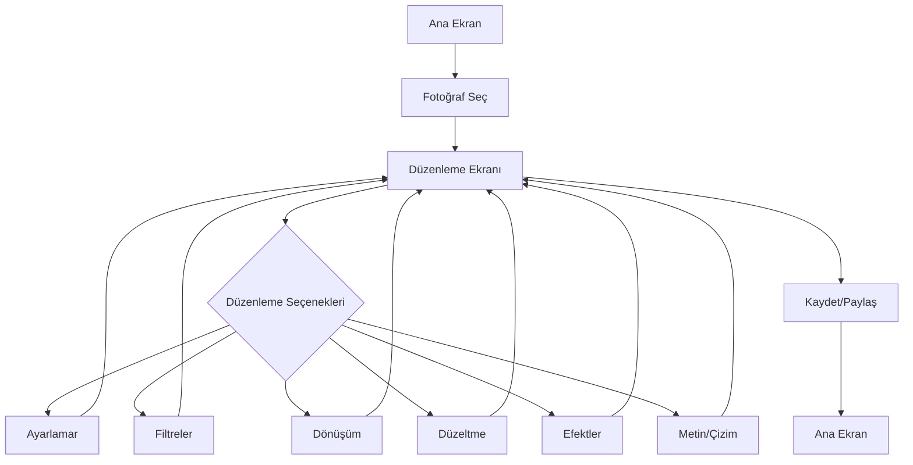

# PhotoNext - Proje Değerlendirmesi ve Planlama

## 📊 Mevcut Projelerin Analizi

### 1. FastPhoto (İlk Proje)

**Özellikler:**
- ✅ Albüm yönetimi (Camera, WhatsApp, Screenshots vb.)
- ✅ Fotoğraf görüntüleme (yatay kaydırma ile)
- ✅ Akıllı silme sistemi (çöp kutusu)
- ✅ Geri yükleme özelliği
- ✅ Kalıcı silme
- ✅ Modern UI/UX (Material Design 3)
- ✅ Dark/Light tema desteği
- ✅ MVVM + Clean Architecture
- ✅ Room Database, Hilt DI, Coil image loading

**Teknik Altyapı:**
- Kotlin + Jetpack Compose
- Min SDK: 29 (Android 10)
- Target SDK: 34 (Android 14)
- Kapsamlı dokümantasyon

**Kritik Eksiklikler:**
- ❌ **Fotoğraf düzenleme özelliği YOK**
- ❌ Filtre yok
- ❌ Ayarlamalar (brightness, contrast vb.) yok
- ❌ Kırpma/döndürme yok
- ❌ Düzenleme geçmişi yok
- ❌ Export/save seçenekleri sınırlı

**Değerlendirme:** Bu proje iyi bir galeri yöneticisi ancak fotoğraf düzenleme uygulaması değil. Kullanıcıların fotoğrafları düzenlemesine izin vermiyor.

---

### 2. FastPhoto - QWEN (İkinci Proje)

**Özellikler:**
- ✅ Basit albüm seçimi
- ✅ Fotoğraf görüntüleme
- ✅ Temel navigasyon

**Teknik Altyapı:**
- Kotlin + Jetpack Compose
- Min SDK: 29
- Target SDK: 34
- Basit mimari (DI yok, database yok)

**Kritik Eksiklikler:**
- ❌ **Fotoğraf düzenleme özelliği YOK**
- ❌ Filtre yok
- ❌ Ayarlamalar yok
- ❌ Kırpma/döndürme yok
- ❌ Çöp kutusu yok
- ❌ Geri yükleme yok
- ❌ Dokümantasyon yok
- ❌ UI/UX sınırlı

**Değerlendirme:** Bu proje çok basit ve eksik. İlk projeden daha az özellik sunuyor ve hiçbir düzenleme kapasitesi yok.

---

## 🎯 Sorun Tespiti

**Temel Sorun:** Her iki proje de **fotoğraf düzenleme** özelliği sunmuyor. Bunlar sadece galeri görüntüleyicileri.

**Kullanıcının İhtiyacı:** Android telefonda fotoğrafları **hızlı ve etkili bir şekilde düzenleyebilecek** bir uygulama.

**Neden Başarısız Oldular?**
1. Yanlış odak: Galeri yönetimi yerine düzenleme yapmalıydı
2. Eksik özellikler: Filtreler, ayarlamalar, kırpma yok
3. Sınırlı UI/UX: Düzenleme için gerekli kontroller yok
4. Yanlış mimari: Düzenleme için gerekli kütüphaneler eksik

---

## 💡 PhotoNext Çözümü

### Temel Hedef
Android cihazlarda fotoğrafları hızlı ve profesyonel bir şekilde düzenleyebilen, kullanıcı dostu bir uygulama oluşturmak.

### Temel İlkeler
1. **Hız:** Anlık önizleme ve hızlı işlemler
2. **Basitlik:** Kolay anlaşılabilir arayüz
3. **Güç:** Profesyonel düzenleme araçları
4. **Esneklik:** Çeşitli düzenleme seçenekleri

---

## 🏗️ PhotoNext Mimari Tasarımı

### Teknoloji Stack
- **Dil:** Kotlin
- **UI Framework:** Jetpack Compose
- **Mimari:** MVVM + Clean Architecture
- **Image Processing:** 
  - Android Graphics API
  - ColorMatrix (filtreler için)
  - Canvas (kırpma/döndürme için)
- **Dependency Injection:** Hilt
- **Asenkron İşlemler:** Coroutines + Flow
- **State Management:** StateFlow + Compose State
- **Image Loading:** Coil
- **Min SDK:** 29 (Android 10)
- **Target SDK:** 34 (Android 14)

### Proje Yapısı
```
PhotoNext/
├── app/
│   ├── src/main/
│   │   ├── java/com/photonext/app/
│   │   │   ├── data/
│   │   │   │   ├── model/          # Data modelleri
│   │   │   │   ├── repository/     # Repository'ler
│   │   │   │   └── local/          # Local storage
│   │   │   ├── domain/
│   │   │   │   ├── usecase/        # Use case'ler
│   │   │   │   └── model/          # Domain modelleri
│   │   │   ├── presentation/
│   │   │   │   ├── ui/
│   │   │   │   │   ├── screens/   # UI ekranları
│   │   │   │   │   ├── components/ # UI bileşenleri
│   │   │   │   │   └── theme/      # Tema
│   │   │   │   └── viewmodel/      # ViewModel'ler
│   │   │   ├── di/                 # Hilt modülleri
│   │   │   ├── util/               # Utility fonksiyonlar
│   │   │   └── PhotoNextApplication.kt
│   │   └── res/
│   └── build.gradle.kts
└── build.gradle.kts
```

---

## 🎨 PhotoNext Özellikleri

### 1. Temel Düzenleme Araçları
- ✅ **Brightness** (Parlaklık) ayarı
- ✅ **Contrast** (Kontrast) ayarı
- ✅ **Saturation** (Doygunluk) ayarı
- ✅ **Exposure** (Pozlama) ayarı
- ✅ **Temperature** (Sıcaklık) ayarı
- ✅ **Tint** (Ton) ayarı
- ✅ **Highlights** (Vurgular) ayarı
- ✅ **Shadows** (Gölgeler) ayarı

### 2. Filtreler
- ✅ **Preset Filtreler:**
  - Vivid (Canlı)
  - Mono (Siyah-beyaz)
  - Sepia (Eski fotoğraf)
  - Warm (Sıcak)
  - Cool (Soğuk)
  - Vintage (Antika)
  - Dramatic (Dramatik)
  - Fade (Soluk)
- ✅ **Özel Filtreler:** Kullanıcı tanımlı filtreler

### 3. Dönüşüm Araçları
- ✅ **Rotate** (Döndürme) - 90°, 180°, 270°
- ✅ **Flip** (Çevirme) - Yatay, Dikey
- ✅ **Crop** (Kırpma) - Serbest, 1:1, 4:3, 16:9, 9:16
- ✅ **Straighten** (Düzeltme) - Otomatik ve manuel

### 4. Düzeltme Araçları
- ✅ **Auto Enhance** (Otomatik iyileştirme)
- ✅ **Red-eye Removal** (Kırmızı göz giderme)
- ✅ **Blemish Removal** (Lekeleri giderme)
- ✅ **Whiten** (Beyazlatma)

### 5. Efektler
- ✅ **Blur** (Bulanıklaştırma) - Gaussian, Motion
- ✅ **Vignette** (Kenar karartma)
- ✅ **Grain** (Tane efekti)
- ✅ **Sharpen** (Keskinleştirme)

### 6. Metin ve Çizim
- ✅ **Text Overlay** (Metin ekleme)
- ✅ **Drawing** (Çizim)
- ✅ **Stickers** (Çıkartmalar)

### 7. Geçmiş ve İşlemler
- ✅ **Undo/Redo** (Geri al/Yeniden yap)
- ✅ **Edit History** (Düzenleme geçmişi)
- ✅ **Compare** (Orijinal ile karşılaştırma)

### 8. Kaydetme ve Paylaşım
- ✅ **Save** (Kaydet) - Orijinal üzerine, Yeni kopya
- ✅ **Export** (Dışa aktar) - JPEG, PNG, WEBP
- ✅ **Quality** (Kalite) ayarı
- ✅ **Resolution** (Çözünürlük) ayarı
- ✅ **Share** (Paylaş) - Sosyal medya, Mesajlaşma

### 9. UI/UX Özellikleri
- ✅ **Before/After** (Öncesi/Sonrası) karşılaştırma
- ✅ **Real-time Preview** (Anlık önizleme)
- ✅ **Slider Controls** (Kaydırıcı kontrolleri)
- ✅ **Preset Gallery** (Hazır ayarlar galerisi)
- ✅ **Dark/Light Theme** (Koyu/Açık tema)
- ✅ **Gesture Support** (Jest desteği) - Pinch to zoom, Swipe
- ✅ **Responsive Design** (Duyarlı tasarım)

---

## 🔄 Kullanıcı Akışı



---

## 📋 Geliştirme Planı

### Aşama 1: Temel Altyapı
1. Proje yapısını oluştur
2. Gradle yapılandırması
3. Temel UI bileşenleri
4. Fotoğraf yükleme ve görüntüleme

### Aşama 2: Temel Düzenleme
1. Ayarlamalar (brightness, contrast, saturation)
2. Filtre sistemi
3. Real-time preview
4. Undo/Redo sistemi

### Aşama 3: Dönüşüm Araçları
1. Rotate ve Flip
2. Crop tool
3. Straighten

### Aşama 4: Gelişmiş Özellikler
1. Efektler (blur, vignette, grain)
2. Düzeltme araçları
3. Metin ve çizim

### Aşama 5: Kaydetme ve Paylaşım
1. Export seçenekleri
2. Kalite ve çözünürlük ayarları
3. Sosyal medya entegrasyonu

### Aşama 6: UI/UX İyileştirmeleri
1. Animasyonlar
2. Jest desteği
3. Performans optimizasyonu

---

## 🎯 Başarı Kriterleri

1. **Hız:** Düzenleme işlemleri < 100ms
2. **Kalite:** Export kalitesi > 90%
3. **Kullanıcı Deneyimi:** < 3 tıklama ile temel düzenleme
4. **Performans:** 4K fotoğraflarda akıcı çalışma
5. **Stabilite:** Crash oranı < 0.1%

---

## 📊 Karşılaştırma Tablosu

| Özellik | FastPhoto | FastPhoto - QWEN | PhotoNext |
|---------|-----------|------------------|-----------|
| Albüm Yönetimi | ✅ | ⚠️ | ✅ |
| Fotoğraf Görüntüleme | ✅ | ✅ | ✅ |
| Brightness Ayarı | ❌ | ❌ | ✅ |
| Contrast Ayarı | ❌ | ❌ | ✅ |
| Filtreler | ❌ | ❌ | ✅ |
| Rotate/Flip | ❌ | ❌ | ✅ |
| Crop | ❌ | ❌ | ✅ |
| Undo/Redo | ❌ | ❌ | ✅ |
| Export Seçenekleri | ❌ | ❌ | ✅ |
| Real-time Preview | ❌ | ❌ | ✅ |
| UI/UX | ✅ | ⚠️ | ✅ |
| Mimari | ✅ | ⚠️ | ✅ |

---

## 🚀 Sonraki Adımlar

1. ✅ Mevcut projeleri analiz et
2. ✅ PhotoNext mimarisini tasarla
3. ⏳ Proje yapısını oluştur
4. ⏳ Temel özellikleri implement et
5. ⏳ Test et ve iyileştir

---

**Sonuç:** PhotoNext, mevcut projelerin eksikliklerini gidererek tam teşekküllü bir fotoğraf düzenleme uygulaması olacak.
