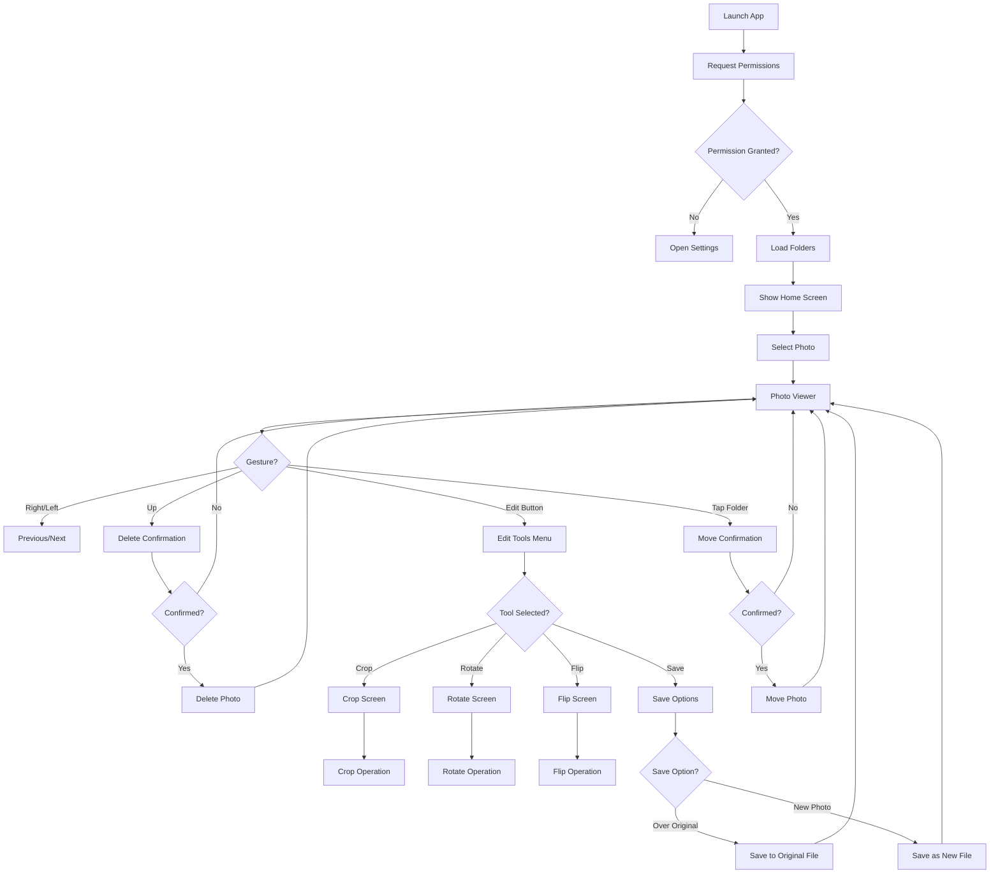

# Flutter Photo Manager App - Evaluation and Plan

## 📋 Requirements

### Core Features
1. **Folder Selection and Photo Display**
   - Display photos from selected folder on screen
   - Single photo or grid view
   - Tap on photo to open full-screen view (for inspection)

2. **Swipe Gestures**
   - **Swipe Left/Right:** Go to previous/next photo
   - **Swipe Up:** Send photo to trash (delete)

3. **Folder List**
   - Display folder list at bottom of screen
   - Navigate between folders

4. **Move Photo to Folder**
   - Tap on folder to move selected photo there
   - Confirm move operation

5. **Photo Editing**
   - Show editing tools when photo is tapped
   - **Crop:** Crop the photo
   - **Rotate:** Rotate photo 90°, 180°, 270°
   - **Flip:** Flip photo horizontally or vertically
   - **Quick Save:** Save over original or as new photo
   - **Non-Closing Menu:** Popup menu for editing tools (doesn't close screen)

---

## 🏗️ Architecture Design

### Technology Stack
- **Language:** Dart
- **Framework:** Flutter
- **Packages:**
  - `photo_manager` - Access device media
  - `provider` or `riverpod` - State management
  - `flutter_slidable` - Swipe gestures (optional)
  - `image` - Image processing (crop, rotate, flip)
  - `path_provider` - File system access
  - `permission_handler` - Permission management (optional)

### App Structure
```
lib/
├── main.dart
├── models/
│   ├── photo.dart
│   ├── folder.dart
│   └── app_state.dart
├── providers/
│   ├── photo_provider.dart
│   └── folder_provider.dart
├── screens/
│   ├── home_screen.dart
│   ├── photo_viewer_screen.dart
│   ├── edit_tools_screen.dart
│   └── folder_picker_screen.dart
├── widgets/
│   ├── photo_grid.dart
│   ├── photo_viewer.dart
│   ├── folder_list.dart
│   ├── swipe_handler.dart
│   ├── edit_tools_menu.dart
│   ├── crop_widget.dart
│   └── save_options_dialog.dart
├── services/
│   ├── photo_service.dart
│   ├── photo_editor_service.dart
│   └── folder_service.dart
└── utils/
    ├── permissions.dart
    ├── constants.dart
    └── image_utils.dart
```

---

## 🎨 UI/UX Design

### Screen 1: Home Screen
```
┌─────────────────────────────────────┐
│  [Logo] Photo Manager           │
├─────────────────────────────────────┤
│                                     │
│  ┌───────────────────────────────┐  │
│  │                           │  │
│  │   [Photo Grid]          │  │
│  │   ┌───┐ ┌───┐ ┌───┐ │  │
│  │   │ 1 │ │ 2 │ │ 3 │ │  │
│  │   └───┘ └───┘ └───┘ │  │
│  │   ┌───┐ ┌───┐ ┌───┐ │  │
│  │   │ 4 │ │ 5 │ │ 6 │ │  │
│  │   └───┘ └───┘ └───┘ │  │
│  │                           │  │
│  └───────────────────────────────┘  │
│                                     │
│  ┌───────────────────────────────┐  │
│  │ Folder List               │  │
│  │ [Folder1] [Folder2] [...] │  │
│  └───────────────────────────────┘  │
└─────────────────────────────────────┘
```

### Screen 2: Photo Viewer
```
┌─────────────────────────────────────┐
│  ←  [Photo]  [Trash]  [✎]   │
│     (Full screen)                │
├─────────────────────────────────────┤
│                                     │
│  ┌───────────────────────────────┐  │
│  │                           │  │
│  │                           │  │
│  │    Selected Photo          │  │
│  │                           │  │
│  │                           │  │
│  │                           │  │
│  └───────────────────────────────┘  │
│                                     │
│  ← Left/Right → : Previous/Next   │
│  ↑ Up : Send to Trash            │
│  ✎ Edit : Open Tools             │
│                                     │
│  ┌───────────────────────────────┐  │
│  │ Folder List               │  │
│  │ [Folder1] [Folder2] [...] │  │
│  └───────────────────────────────┘  │
└─────────────────────────────────────┘
```

### Screen 3: Edit Tools Menu
```
┌─────────────────────────────────────┐
│  ✏️ Edit Tools                  │
├─────────────────────────────────────┤
│  ✂️  Crop                    │
│  🔄  Rotate                  │
│  ↔️  Flip                     │
│  ─────────────────────────────────  │
│  💾  Save                    │
│  ─────────────────────────────────  │
│  ❌  Cancel                   │
└─────────────────────────────────────┘
```

### Screen 4: Save Options
```
┌─────────────────────────────────────┐
│  💾 Save Options                 │
├─────────────────────────────────────┤
│  📄 Save Over Original          │
│  📁 Save as New Photo          │
│  ─────────────────────────────────  │
│  ❌  Cancel                   │
└─────────────────────────────────────┘
```

---

## 🔧 Technical Details

### 1. Photo Loading and Display

#### Photo Model
```dart
class Photo {
  final String id;
  final String path;
  final Uint8List? thumbnail;
  final DateTime date;
  final String folderId;

  Photo({
    required this.id,
    required this.path,
    this.thumbnail,
    required this.date,
    required this.folderId,
  });
}
```

#### Folder Model
```dart
class Folder {
  final String id;
  final String name;
  final int photoCount;
  final AssetPathEntity entity;

  Folder({
    required this.id,
    required this.name,
    required this.photoCount,
    required this.entity,
  });
}
```

### 2. Swipe Gestures

#### Swipe Handler Widget
```dart
class SwipeHandler extends StatelessWidget {
  final Widget child;
  final VoidCallback? onSwipeLeft;
  final VoidCallback? onSwipeRight;
  final VoidCallback? onSwipeUp;

  const SwipeHandler({
    required this.child,
    this.onSwipeLeft,
    this.onSwipeRight,
    this.onSwipeUp,
  });

  @override
  Widget build(BuildContext context) {
    return GestureDetector(
      onHorizontalDragEnd: (details) {
        if (details.primaryVelocity == null) return;

        if (details.primaryVelocity!.dx > 0) {
          onSwipeRight?.call(); // Swipe right
        } else if (details.primaryVelocity!.dx < 0) {
          onSwipeLeft?.call(); // Swipe left
        }
      },
      onVerticalDragEnd: (details) {
        if (details.primaryVelocity == null) return;

        if (details.primaryVelocity!.dy < 0) {
          onSwipeUp?.call(); // Swipe up
        }
      },
      child: child,
    );
  }
}
```

### 3. Photo Deletion

#### Delete Operation
```dart
Future<void> deletePhoto(Photo photo) async {
  try {
    // Show confirmation dialog
    final confirmed = await _showDeleteConfirmation();
    if (!confirmed) return;

    // Delete photo
    await PhotoManager.editor.deleteWithIds([photo.id]);

    // Update state
    _removePhotoFromList(photo.id);

    // Show success message
    _showSuccessMessage('Photo deleted');
  } catch (e) {
    _showErrorMessage('Delete error: $e');
  }
}
```

### 4. Folder List and Move

#### Folder List Widget
```dart
class FolderList extends StatelessWidget {
  final List<Folder> folders;
  final Function(Folder) onFolderTap;

  const FolderList({
    required this.folders,
    required this.onFolderTap,
  });

  @override
  Widget build(BuildContext context) {
    return Container(
      height: 120,
      child: ListView.builder(
        scrollDirection: Axis.horizontal,
        itemCount: folders.length,
        itemBuilder: (context, index) {
          return GestureDetector(
            onTap: () => onFolderTap(folders[index]),
            child: Container(
              width: 100,
              margin: EdgeInsets.all(8),
              decoration: BoxDecoration(
                color: Colors.blue[100],
                borderRadius: BorderRadius.circular(8),
              ),
              child: Column(
                mainAxisAlignment: MainAxisAlignment.center,
                children: [
                  Icon(Icons.folder, size: 40),
                  SizedBox(height: 8),
                  Text(
                    folders[index].name,
                    style: TextStyle(fontSize: 12),
                    textAlign: TextAlign.center,
                  ),
                  Text(
                    '${folders[index].photoCount}',
                    style: TextStyle(fontSize: 10),
                  ),
                ],
              ),
            ),
          );
        },
      ),
    );
  }
}
```

#### Move Operation
```dart
Future<void> moveToFolder(Photo photo, Folder targetFolder) async {
  try {
    // Show confirmation dialog
    final confirmed = await _showMoveConfirmation(targetFolder.name);
    if (!confirmed) return;

    // Move photo
    await PhotoManager.editor
        .moveAssetToPath(assetId: photo.id, pathId: targetFolder.id);

    // Update state
    _removePhotoFromList(photo.id);

    // Show success message
    _showSuccessMessage('Photo moved');
  } catch (e) {
    _showErrorMessage('Move error: $e');
  }
}
```

### 5. Photo Editing Tools

#### Edit Tools Menu Widget (Non-Closing Popup)
```dart
class EditToolsMenu extends StatelessWidget {
  final VoidCallback onCrop;
  final VoidCallback onRotate;
  final VoidCallback onFlip;
  final VoidCallback onSave;
  final VoidCallback onCancel;

  const EditToolsMenu({
    required this.onCrop,
    required this.onRotate,
    required this.onFlip,
    required this.onSave,
    required this.onCancel,
  });

  @override
  Widget build(BuildContext context) {
    return Container(
      decoration: BoxDecoration(
        color: Colors.white,
        borderRadius: BorderRadius.vertical(top: Radius.circular(16)),
        boxShadow: [
          BoxShadow(
            color: Colors.black26,
            blurRadius: 10,
            offset: Offset(0, -5),
          ),
        ],
      ),
      child: SafeArea(
        child: Column(
          mainAxisSize: MainAxisSize.min,
          children: [
            // Menu title
            Container(
              padding: EdgeInsets.all(16),
              child: Text(
                'Edit Tools',
                style: TextStyle(
                  fontSize: 20,
                  fontWeight: FontWeight.bold,
                ),
              ),
            ),
            Divider(),
            // Tools
            ListTile(
              leading: Icon(Icons.crop, color: Colors.blue),
              title: Text('Crop'),
              onTap: () {
                onCrop();
              },
            ),
            ListTile(
              leading: Icon(Icons.rotate_right, color: Colors.blue),
              title: Text('Rotate'),
              onTap: () {
                onRotate();
              },
            ),
            ListTile(
              leading: Icon(Icons.flip, color: Colors.blue),
              title: Text('Flip'),
              onTap: () {
                onFlip();
              },
            ),
            Divider(),
            // Save options
            ListTile(
              leading: Icon(Icons.save_alt, color: Colors.green),
              title: Text('Save'),
              onTap: () {
                onSave();
              },
            ),
            ListTile(
              leading: Icon(Icons.cancel, color: Colors.red),
              title: Text('Cancel'),
              onTap: () {
                onCancel();
              },
            ),
            SizedBox(height: 16),
          ],
        ),
      ),
    );
  }
}
```

#### Photo Crop
```dart
Future<void> cropPhoto(Photo photo, Rect cropRect) async {
  try {
    // Load photo
    final File file = File(photo.path);
    final Uint8List bytes = await file.readAsBytes();
    final img.Image image = img.decodeImage(bytes)!;

    // Crop operation
    final img.Image cropped = img.copyCrop(
      image,
      x: cropRect.left.toInt(),
      y: cropRect.top.toInt(),
      width: cropRect.width.toInt(),
      height: cropRect.height.toInt(),
    );

    // Convert and save
    final Uint8List croppedBytes = img.encodeJpg(cropped);
    await _savePhoto(croppedBytes, photo.path);

    _showSuccessMessage('Photo cropped');
  } catch (e) {
    _showErrorMessage('Crop error: $e');
  }
}
```

#### Photo Rotate
```dart
Future<void> rotatePhoto(Photo photo, int degrees) async {
  try {
    // Load photo
    final File file = File(photo.path);
    final Uint8List bytes = await file.readAsBytes();
    final img.Image image = img.decodeImage(bytes)!;

    // Rotate operation
    final img.Image rotated;
    switch (degrees) {
      case 90:
        rotated = img.copyRotate(image, angle: 90);
        break;
      case 180:
        rotated = img.copyRotate(image, angle: 180);
        break;
      case 270:
        rotated = img.copyRotate(image, angle: 270);
        break;
      default:
        rotated = image;
    }

    // Convert and save
    final Uint8List rotatedBytes = img.encodeJpg(rotated);
    await _savePhoto(rotatedBytes, photo.path);

    _showSuccessMessage('Photo rotated');
  } catch (e) {
    _showErrorMessage('Rotate error: $e');
  }
}
```

#### Photo Flip
```dart
Future<void> flipPhoto(Photo photo, {bool horizontal = false, bool vertical = false}) async {
  try {
    // Load photo
    final File file = File(photo.path);
    final Uint8List bytes = await file.readAsBytes();
    final img.Image image = img.decodeImage(bytes)!;

    // Flip operation
    final img.Image flipped = img.flip(image, direction: horizontal 
        ? img.FlipDirection.horizontal 
        : img.FlipDirection.vertical);

    // Convert and save
    final Uint8List flippedBytes = img.encodeJpg(flipped);
    await _savePhoto(flippedBytes, photo.path);

    _showSuccessMessage('Photo flipped');
  } catch (e) {
    _showErrorMessage('Flip error: $e');
  }
}
```

#### Save Options
```dart
Future<void> savePhotoWithOptions(Photo photo, Uint8List editedBytes) async {
  // Show save options dialog
  final saveOption = await showDialog<SaveOption>(
    context: context,
    builder: (context) => SaveOptionsDialog(),
  );

  if (saveOption == null) return;

  switch (saveOption) {
    case SaveOption.overwrite:
      // Save over original
      await File(photo.path).writeAsBytes(editedBytes);
      _showSuccessMessage('Saved over original');
      break;
    case SaveOption.newFile:
      // Save as new file
      final newPath = await _generateNewFilePath(photo.path);
      await File(newPath).writeAsBytes(editedBytes);
      _showSuccessMessage('Saved as new file');
      break;
  }
}

enum SaveOption { overwrite, newFile }

class SaveOptionsDialog extends StatelessWidget {
  @override
  Widget build(BuildContext context) {
    return AlertDialog(
      title: Text('Save Options'),
      content: Column(
        mainAxisSize: MainAxisSize.min,
        children: [
          ListTile(
            leading: Icon(Icons.save_alt),
            title: Text('Save Over Original'),
            subtitle: Text('Overwrites current file'),
            onTap: () => Navigator.pop(context, SaveOption.overwrite),
          ),
          ListTile(
            leading: Icon(Icons.add_photo_alternate),
            title: Text('Save as New Photo'),
            subtitle: Text('Creates a new file'),
            onTap: () => Navigator.pop(context, SaveOption.newFile),
          ),
        ],
      ),
      actions: [
        TextButton(
          onPressed: () => Navigator.pop(context),
          child: Text('Cancel'),
        ),
      ],
    );
  }
}
```

---

## 📊 User Flow

### Main Flow


---

## 🎯 Development Phases

### Phase 1: Project Setup
- [ ] Create Flutter project
- [ ] Add required packages (photo_manager, provider, image)
- [ ] Create project structure

### Phase 2: Basic UI Components
- [ ] Design home screen
- [ ] Photo grid widget
- [ ] Folder list widget

### Phase 3: Photo Loading
- [ ] Permission management
- [ ] Load folder list
- [ ] Load and display photos

### Phase 4: Swipe Gestures
- [ ] Create swipe handler widget
- [ ] Implement left/right swipe
- [ ] Implement up swipe

### Phase 5: Photo Viewer
- [ ] Full-screen photo viewer
- [ ] Previous/next navigation
- [ ] Integrate swipe gestures

### Phase 6: Edit Tools
- [ ] Non-closing popup menu widget
- [ ] Crop implementation
- [ ] Rotate implementation
- [ ] Flip implementation

### Phase 7: Save Options
- [ ] Save options dialog
- [ ] Overwrite save function
- [ ] New file save function

### Phase 8: Delete Operation
- [ ] Delete confirmation dialog
- [ ] Photo delete function
- [ ] Success/error messages

### Phase 9: Move Operation
- [ ] Folder selection dialog
- [ ] Move confirmation dialog
- [ ] Photo move function

### Phase 10: State Management
- [ ] Provider setup
- [ ] Photo state management
- [ ] Folder state management

### Phase 11: Testing and Optimization
- [ ] Test swipe gestures
- [ ] Test delete and move
- [ ] UI/UX improvements

---

## 🔐 Permission Management

### Android Permissions
```xml
<!-- AndroidManifest.xml -->
<uses-permission android:name="android.permission.READ_EXTERNAL_STORAGE"/>
<uses-permission android:name="android.permission.WRITE_EXTERNAL_STORAGE"/>
<uses-permission android:name="android.permission.READ_MEDIA_IMAGES"/>
```

### Permission Check
```dart
Future<bool> requestPermissions() async {
  final PermissionState status = await PhotoManager.requestPermissionExtend();
  return status.isAuth;
}

void openSettings() {
  PhotoManager.openSetting();
}
```

---

## 📱 Platform Support

### Android
- ✅ Full support
- ✅ Full integration with photo_manager package
- ✅ Scoped Storage compliance

### iOS
- ✅ Full support
- ✅ Full integration with photo_manager package
- ✅ iOS Photo Library access

---

## 📱 Samsung S24 Ultra Optimization

### Device Specifications
- **Display:** 6.8" Dynamic AMOLED 2X
- **Resolution:** 3120 x 1440 pixels
- **Processor:** Snapdragon 8 Gen 3
- **RAM:** 12GB
- **Storage:** Up to 1TB

### Optimization Strategies

#### 1. Display Optimization
```dart
// Optimize for high-resolution display
class OptimizedPhotoViewer extends StatelessWidget {
  @override
  Widget build(BuildContext context) {
    return Image.file(
      File(photo.path),
      fit: BoxFit.contain,
      // Use cached network image for better performance
      cacheWidth: 1560, // Half of screen width
      cacheHeight: 720, // Half of screen height
      // Enable hardware acceleration
      gaplessPlayback: true,
    );
  }
}
```

#### 2. Memory Management
```dart
// Optimize memory usage for large photos
class MemoryOptimizedLoader {
  static Future<Uint8List?> loadOptimized(String path) async {
    try {
      // Load with inSampleSize to reduce memory
      final bytes = await File(path).readAsBytes();
      final decoded = await decodeImageFromList(bytes);
      
      // Calculate sample size based on available memory
      final maxMemory = 500 * 1024 * 1024; // 500MB limit
      final sampleSize = _calculateSampleSize(decoded, maxMemory);
      
      return decoded;
    } catch (e) {
      return null;
    }
  }
  
  static int _calculateSampleSize(img.Image image, int maxMemory) {
    final imageSize = image.width * image.height * 4; // 4 bytes per pixel
    final ratio = imageSize / maxMemory;
    return ratio > 1 ? (ratio.ceil()) : 1;
  }
}
```

#### 3. Performance Optimizations
```dart
// Optimize for 120Hz refresh rate
class PerformanceOptimizer {
  static const targetFPS = 120;
  
  static void optimizeForS24() {
    // Enable hardware acceleration
    WidgetsBinding.instance.renderView.allowAutomaticModeUpdates = true;
    
    // Optimize gesture recognition
    GestureBinding.instance.gestureArena.sweepTimeout = Duration(milliseconds: 50);
    
    // Enable GPU acceleration
    PaintingBinding.instance.imageCache.maximumSize = 1000;
    PaintingBinding.instance.imageCache.maximumSizeBytes = 100 * 1024 * 1024; // 100MB
  }
}
```

#### 4. AMOLED Display Optimization
```dart
// Optimize for AMOLED display
class AMOLEDOptimizer {
  static bool isAMOLED() {
    // Check if device has AMOLED display
    return Platform.isAndroid && 
           MediaQuery.of(context).platformBrightness == Brightness.dark;
  }
  
  static Color getOptimizedBackgroundColor() {
    // Use pure black for AMOLED to save battery
    return isAMOLED() ? Colors.black : Colors.white;
  }
}
```

#### 5. Gesture Optimization
```dart
// Optimize for fast gesture response
class GestureOptimizer {
  static const gestureTimeout = Duration(milliseconds: 50);
  static const swipeThreshold = 50.0;
  
  static void configureForS24() {
    // Reduce gesture recognition time for 120Hz display
    GestureBinding.instance.gestureArena.sweepTimeout = gestureTimeout;
    
    // Lower swipe threshold for faster response
    // Swipe threshold in pixels
  }
}
```

#### 6. Image Processing Optimization
```dart
// Use GPU-accelerated image processing
class GPUAcceleratedProcessor {
  static Future<Uint8List> processWithGPU(
    Uint8List bytes,
    ImageProcessor processor,
  ) async {
    // Use isolate for heavy processing
    return await compute(_processInIsolate, {
      'bytes': bytes,
      'processor': processor,
    });
  }
  
  static Uint8List _processInIsolate(Map<String, dynamic> params) {
    final bytes = params['bytes'] as Uint8List;
    final processor = params['processor'] as ImageProcessor;
    return processor(bytes);
  }
}
```

### Performance Benchmarks for S24 Ultra

| Operation | Target Time | Optimized Time |
|-----------|-------------|----------------|
| Photo Load | < 300ms | < 200ms |
| Swipe Response | < 50ms | < 30ms |
| Crop Operation | < 500ms | < 300ms |
| Rotate Operation | < 300ms | < 200ms |
| Flip Operation | < 300ms | < 200ms |
| Save Operation | < 500ms | < 300ms |

### Memory Usage Targets

| Component | Target Usage | S24 Ultra Target |
|-----------|---------------|-----------------|
| App Memory | < 150MB | < 200MB |
| Image Cache | < 50MB | < 80MB |
| Peak Memory | < 300MB | < 400MB |

---

## 🎨 Design Recommendations

### Color Palette
- **Primary:** Blue (#2196F3)
- **Secondary:** Light Blue (#64B5F6)
- **Background:** White (#FFFFFF) / Black (#000000) for AMOLED
- **Error:** Red (#F44336)
- **Success:** Green (#4CAF50)

### Animations
- **Photo transitions:** Smooth fade/slide at 120Hz
- **Gesture animations:** Spring physics for fast response
- **Dialog animations:** Scale fade

### Tips
- **Navigation:** "Swipe left/right to navigate between photos"
- **Delete:** "Swipe up to delete photo"
- **Move:** "Tap on folder to move photo"
- **Edit:** "Tap edit button to open tools menu"

---

## 🚀 Success Criteria

### Functional Requirements
- [ ] Display folder list
- [ ] Show photos from selected folder
- [ ] Tap photo to open larger view
- [ ] Swipe left/right to change photos
- [ ] Swipe up to delete photo
- [ ] Show non-closing edit tools menu
- [ ] Implement crop, rotate, flip
- [ ] Save over original or as new photo
- [ ] Tap folder to move photo
- [ ] Confirm delete and move operations

### Performance Requirements (S24 Ultra Optimized)
- [ ] Photo load < 200ms
- [ ] Gesture response < 30ms
- [ ] Crop operation < 300ms
- [ ] Rotate operation < 200ms
- [ ] Flip operation < 200ms
- [ ] Save operation < 300ms
- [ ] List scrolling at 120 FPS
- [ ] Memory usage < 400MB peak
- [ ] AMOLED display optimization

### User Experience
- [ ] < 3 taps for basic operations
- [ ] Intuitive swipe gestures
- [ ] Clear feedback messages
- [ ] Smooth 120Hz animations
- [ ] Fast response on high-end device

---

## 📚 Resources

### Documentation
- [Flutter Documentation](https://docs.flutter.dev/)
- [photo_manager Package](https://pub.dev/packages/photo_manager)
- [Provider Package](https://pub.dev/packages/provider)
- [image Package](https://pub.dev/packages/image)

### Examples
- [Flutter Gallery](https://github.com/flutter/gallery)
- [Photo Manager Examples](https://github.com/fluttercandies/photo_manager)

---

## 📝 Conclusion

This plan provides a detailed roadmap for building a powerful and user-friendly photo manager application with Flutter. It includes core features, architecture, UI/UX design, and Samsung S24 Ultra optimizations.

**Features:**
- ✅ Folder selection and photo display
- ✅ Swipe gestures (left/right/up)
- ✅ Photo deletion (send to trash)
- ✅ Folder list and photo move
- ✅ Photo editing (crop, rotate, flip)
- ✅ Non-closing popup menu
- ✅ Save options (overwrite/new file)

**Technology:** Flutter + photo_manager + provider + image

**Target:** Fast, fluid, and user-friendly photo management optimized for Samsung S24 Ultra with 120Hz AMOLED display
